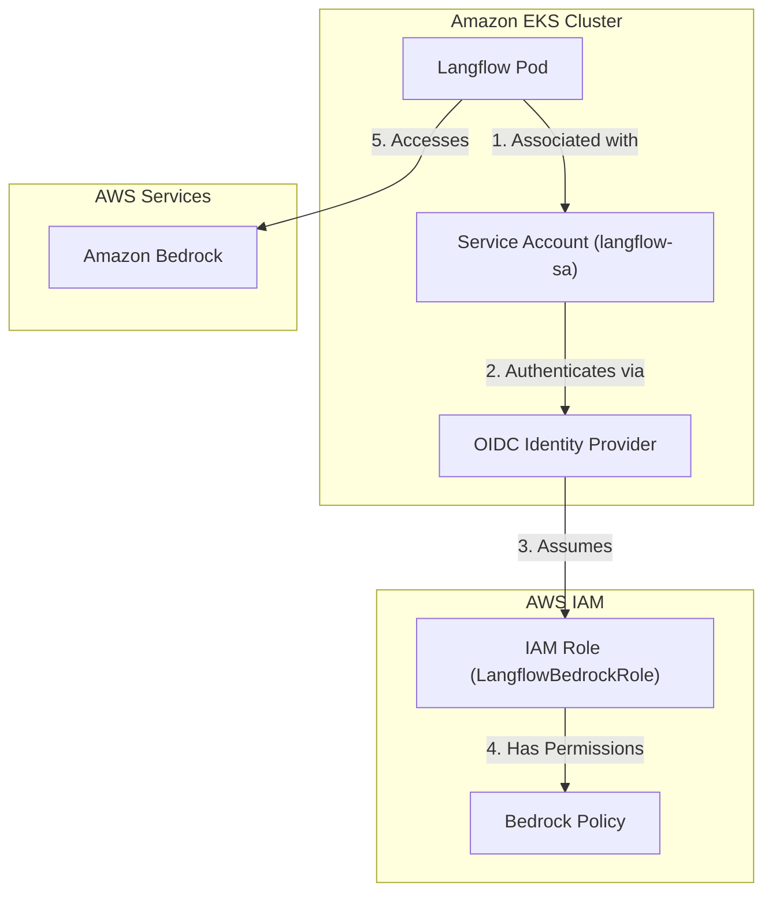

# Langflow AWS Bedrock Setup Guide
## Using IAM Roles for Service Accounts (IRSA) on EKS

### Overview

This guide explains how to configure Langflow running on Amazon EKS to access AWS Bedrock using IAM Roles for Service Accounts (IRSA). This approach eliminates the need for hardcoded AWS credentials and follows AWS security best practices.

### Architecture Overview



---

## Prerequisites

- An existing EKS cluster
- AWS CLI installed and configured
- `eksctl` installed (or ability to create OIDC providers manually)
- `kubectl` configured to access your EKS cluster
- Permissions to create IAM roles and policies

---

## Step 1: Associate OIDC Provider with EKS Cluster

If your cluster doesn't already have an OIDC provider associated, create one:

```bash
# Set your cluster details
CLUSTER_NAME="your-cluster-name"
REGION="us-east-1"

# Associate OIDC provider
eksctl utils associate-iam-oidc-provider \
  --cluster $CLUSTER_NAME \
  --region $REGION \
  --approve
```

**Verify the OIDC provider:**

```bash
aws eks describe-cluster \
  --name $CLUSTER_NAME \
  --query "cluster.identity.oidc.issuer" \
  --output text
```

This will output something like:
```
https://oidc.eks.us-east-1.amazonaws.com/id/EXAMPLED539D4633E53DE1B71EXAMPLE
```

Save this URL - you'll need the ID part (after `/id/`).

---

## Step 2: Create IAM Role with IRSA Trust Policy

### 2.1 Get Your OIDC Provider ID

```bash
OIDC_PROVIDER=$(aws eks describe-cluster \
  --name $CLUSTER_NAME \
  --query "cluster.identity.oidc.issuer" \
  --output text | sed 's|https://||')

echo $OIDC_PROVIDER
```

### 2.2 Create Trust Policy

Create a file named `irsa-trust-policy.json`:

```json
{
  "Version": "2012-10-17",
  "Statement": [
    {
      "Effect": "Allow",
      "Principal": {
        "Federated": "arn:aws:iam::YOUR_ACCOUNT_ID:oidc-provider/OIDC_PROVIDER_URL"
      },
      "Action": "sts:AssumeRoleWithWebIdentity",
      "Condition": {
        "StringEquals": {
          "OIDC_PROVIDER_URL:sub": "system:serviceaccount:langflow:langflow-sa",
          "OIDC_PROVIDER_URL:aud": "sts.amazonaws.com"
        }
      }
    }
  ]
}
```

**Replace:**
- `YOUR_ACCOUNT_ID` with your AWS account ID (e.g., `130376568147`)
- `OIDC_PROVIDER_URL` with the full OIDC URL from Step 1 (without `https://`)
- `langflow` with your namespace
- `langflow-sa` with your service account name

**Example:**
```json
{
  "Version": "2012-10-17",
  "Statement": [
    {
      "Effect": "Allow",
      "Principal": {
        "Federated": "arn:aws:iam::130376568147:oidc-provider/oidc.eks.us-east-1.amazonaws.com/id/EXAMPLED539D4633E53DE1B71EXAMPLE"
      },
      "Action": "sts:AssumeRoleWithWebIdentity",
      "Condition": {
        "StringEquals": {
          "oidc.eks.us-east-1.amazonaws.com/id/EXAMPLED539D4633E53DE1B71EXAMPLE:sub": "system:serviceaccount:langflow:langflow-sa",
          "oidc.eks.us-east-1.amazonaws.com/id/EXAMPLED539D4633E53DE1B71EXAMPLE:aud": "sts.amazonaws.com"
        }
      }
    }
  ]
}
```

### 2.3 Create the IAM Role

```bash
aws iam create-role \
  --role-name LangflowBedrockRole \
  --assume-role-policy-document file://irsa-trust-policy.json \
  --description "Role for Langflow to access AWS Bedrock via IRSA"
```

---

## Step 3: Attach Bedrock Permissions to the Role

### Option A: Use AWS Managed Policy (Full Access)

```bash
aws iam attach-role-policy \
  --role-name LangflowBedrockRole \
  --policy-arn arn:aws:iam::aws:policy/AmazonBedrockFullAccess
```

### Option B: Create Custom Policy (Least Privilege)

Create a file named `bedrock-permissions.json`:

```json
{
  "Version": "2012-10-17",
  "Statement": [
    {
      "Effect": "Allow",
      "Action": [
        "bedrock:InvokeModel",
        "bedrock:InvokeModelWithResponseStream"
      ],
      "Resource": "*"
    }
  ]
}
```

Create and attach the policy:

```bash
# Create the policy
aws iam create-policy \
  --policy-name LangflowBedrockAccess \
  --policy-document file://bedrock-permissions.json

# Attach to the role
aws iam attach-role-policy \
  --role-name LangflowBedrockRole \
  --policy-arn arn:aws:iam::YOUR_ACCOUNT_ID:policy/LangflowBedrockAccess
```

---

## Step 4: Create Kubernetes Service Account

Create a file named `langflow-serviceaccount.yaml`:

```yaml
apiVersion: v1
kind: ServiceAccount
metadata:
  name: langflow-sa
  namespace: langflow
  annotations:
    eks.amazonaws.com/role-arn: arn:aws:iam::YOUR_ACCOUNT_ID:role/LangflowBedrockRole
```

**Replace `YOUR_ACCOUNT_ID`** with your AWS account ID.

Apply it:

```bash
# Create namespace if it doesn't exist
kubectl create namespace langflow

# Create service account
kubectl apply -f langflow-serviceaccount.yaml
```

Verify:

```bash
kubectl describe serviceaccount langflow-sa -n langflow
```

You should see the role ARN in the annotations.

---

## Step 5: Update Langflow Deployment

Update your Langflow deployment to use the service account.

Create or update `langflow-deployment.yaml`:

```yaml
apiVersion: apps/v1
kind: Deployment
metadata:
  name: langflow
  namespace: langflow
spec:
  replicas: 1
  selector:
    matchLabels:
      app: langflow
  template:
    metadata:
      labels:
        app: langflow
    spec:
      serviceAccountName: langflow-sa  # ← Important!
      containers:
      - name: langflow
        image: langflow/langflow:latest
        ports:
        - containerPort: 7860
        env:
        - name: AWS_REGION
          value: "us-east-1"
        # Add other environment variables as needed
---
apiVersion: v1
kind: Service
metadata:
  name: langflow-service
  namespace: langflow
spec:
  selector:
    app: langflow
  ports:
  - port: 80
    targetPort: 7860
  type: LoadBalancer
```

Apply the deployment:

```bash
kubectl apply -f langflow-deployment.yaml
```

---

## Step 6: Modify Langflow Component (Simplified)

With IRSA, the Langflow component becomes much simpler. The boto3 library automatically retrieves credentials from the pod's metadata.

### Modified Component Code

```python
from langflow.field_typing import LanguageModel
from langflow.inputs.inputs import BoolInput, FloatInput, IntInput, MessageTextInput
from langflow.io import DictInput, DropdownInput

from lfx.base.models.aws_constants import AWS_REGIONS, AWS_MODEL_IDs
from lfx.base.models.model import LCModelComponent


class AmazonBedrockConverseComponent(LCModelComponent):
    display_name: str = "Amazon Bedrock Converse"
    description: str = (
        "Generate text using Amazon Bedrock LLMs with the modern Converse API."
    )
    icon = "Amazon"
    name = "AmazonBedrockConverseModel"
    beta = True

    inputs = [
        *LCModelComponent.get_base_inputs(),
        DropdownInput(
            name="model_id",
            display_name="Model ID",
            options=AWS_MODEL_IDs,
            value="anthropic.claude-3-5-sonnet-20241022-v2:0",
            info="List of available model IDs to choose from.",
        ),
        DropdownInput(
            name="region_name",
            display_name="Region Name",
            value="us-east-1",
            options=AWS_REGIONS,
            info="The AWS region where your Bedrock resources are located.",
        ),
        FloatInput(
            name="temperature",
            display_name="Temperature",
            value=0.7,
            info="Controls randomness in output.",
            advanced=True,
        ),
        IntInput(
            name="max_tokens",
            display_name="Max Tokens",
            value=4096,
            info="Maximum number of tokens to generate.",
            advanced=True,
        ),
        FloatInput(
            name="top_p",
            display_name="Top P",
            value=0.9,
            info="Nucleus sampling parameter.",
            advanced=True,
        ),
        BoolInput(
            name="disable_streaming",
            display_name="Disable Streaming",
            value=False,
            info="If True, disables streaming responses.",
            advanced=True,
        ),
        DictInput(
            name="additional_model_fields",
            display_name="Additional Model Fields",
            advanced=True,
            is_list=True,
            info="Additional model-specific parameters.",
        ),
    ]

    def build_model(self) -> LanguageModel:
        try:
            from langchain_aws.chat_models.bedrock_converse import ChatBedrockConverse
        except ImportError as e:
            msg = "langchain_aws is not installed. Please install it with `pip install langchain_aws`."
            raise ImportError(msg) from e

        # With IRSA, boto3 automatically retrieves credentials from pod metadata
        # No need to manually specify credentials or assume roles
        init_params = {
            "model": self.model_id,
            "region_name": self.region_name,
        }

        # Add model parameters
        if hasattr(self, "temperature") and self.temperature is not None:
            init_params["temperature"] = self.temperature
        if hasattr(self, "max_tokens") and self.max_tokens is not None:
            init_params["max_tokens"] = self.max_tokens
        if hasattr(self, "top_p") and self.top_p is not None:
            init_params["top_p"] = self.top_p

        if hasattr(self, "disable_streaming") and self.disable_streaming:
            init_params["disable_streaming"] = True

        additional_model_request_fields = {}
        if hasattr(self, "additional_model_fields") and self.additional_model_fields:
            for field in self.additional_model_fields:
                if isinstance(field, dict):
                    additional_model_request_fields.update(field)

        if additional_model_request_fields:
            init_params["additional_model_request_fields"] = additional_model_request_fields

        try:
            output = ChatBedrockConverse(**init_params)
        except Exception as e:
            error_details = str(e)
            msg = f"Could not initialize ChatBedrockConverse: {error_details}"
            raise ValueError(msg) from e

        return output
```

**Key Changes:**
- Removed all credential-related inputs (access keys, secret keys, role ARN)
- boto3 automatically uses IRSA credentials from the pod's service account
- Much simpler and more secure

---

## Step 7: Verify the Setup

### 7.1 Check Pod Has Service Account

```bash
kubectl get pod -n langflow -o yaml | grep serviceAccountName
```

Should show: `serviceAccountName: langflow-sa`

### 7.2 Verify AWS Credentials in Pod

```bash
# Get pod name
POD_NAME=$(kubectl get pods -n langflow -l app=langflow -o jsonpath='{.items[0].metadata.name}')

# Check AWS environment variables
kubectl exec -n langflow $POD_NAME -- env | grep AWS
```

You should see:
```
AWS_ROLE_ARN=arn:aws:iam::YOUR_ACCOUNT_ID:role/LangflowBedrockRole
AWS_WEB_IDENTITY_TOKEN_FILE=/var/run/secrets/eks.amazonaws.com/serviceaccount/token
```

### 7.3 Test AWS STS from Pod

```bash
kubectl exec -n langflow $POD_NAME -- aws sts get-caller-identity
```

Should return:
```json
{
    "UserId": "AROAXXXXXXXXXXXXXXXXX:botocore-session-XXXXXXXXXX",
    "Account": "YOUR_ACCOUNT_ID",
    "Arn": "arn:aws:sts::YOUR_ACCOUNT_ID:assumed-role/LangflowBedrockRole/botocore-session-XXXXXXXXXX"
}
```

---

## Troubleshooting

### Issue: Pod can't assume role

**Check:**
1. OIDC provider is correctly associated with cluster
2. Trust policy uses correct OIDC provider URL
3. Service account annotation has correct role ARN
4. Pod is using the correct service account

**Verify trust relationship:**
```bash
aws iam get-role --role-name LangflowBedrockRole --query 'Role.AssumeRolePolicyDocument'
```

### Issue: Access denied to Bedrock

**Check:**
1. Role has Bedrock permissions attached
2. Bedrock is available in your region
3. Model access is enabled in Bedrock console

**Verify permissions:**
```bash
aws iam list-attached-role-policies --role-name LangflowBedrockRole
```

### Issue: Wrong credentials being used

**Check environment variables in pod:**
```bash
kubectl exec -n langflow $POD_NAME -- env | grep -E 'AWS|LANGFLOW'
```

Remove any hardcoded credentials from configmaps or secrets.

---

## Security Best Practices

1. **Least Privilege**: Grant only the minimum permissions needed
2. **Audit Logging**: Enable CloudTrail to audit Bedrock API calls
3. **Resource Restrictions**: Use IAM policy conditions to restrict which models can be invoked
4. **Network Policies**: Use Kubernetes network policies to restrict pod communication
5. **Regular Rotation**: Although IRSA credentials auto-rotate, review role policies regularly

---

## Benefits of IRSA Approach

✅ **No hardcoded credentials** - Eliminates risk of credential exposure  
✅ **Automatic credential rotation** - AWS handles credential lifecycle  
✅ **Granular permissions** - Different pods can have different permissions  
✅ **Audit trail** - CloudTrail shows which pod made which API calls  
✅ **AWS best practices** - Recommended approach by AWS  
✅ **Easier management** - No need to distribute or update credentials

---

## Additional Resources

- [AWS IRSA Documentation](https://docs.aws.amazon.com/eks/latest/userguide/iam-roles-for-service-accounts.html)
- [Amazon Bedrock Documentation](https://docs.aws.amazon.com/bedrock/)
- [Langflow Documentation](https://docs.langflow.org/)

---

## Appendix: Alternative for Local Development

For local development (laptop), you can still use the role assumption approach from the original component, or simply use AWS CLI credentials:

```bash
# Configure AWS CLI
aws configure

# Leave all credential fields empty in Langflow
# The component will automatically use ~/.aws/credentials
```