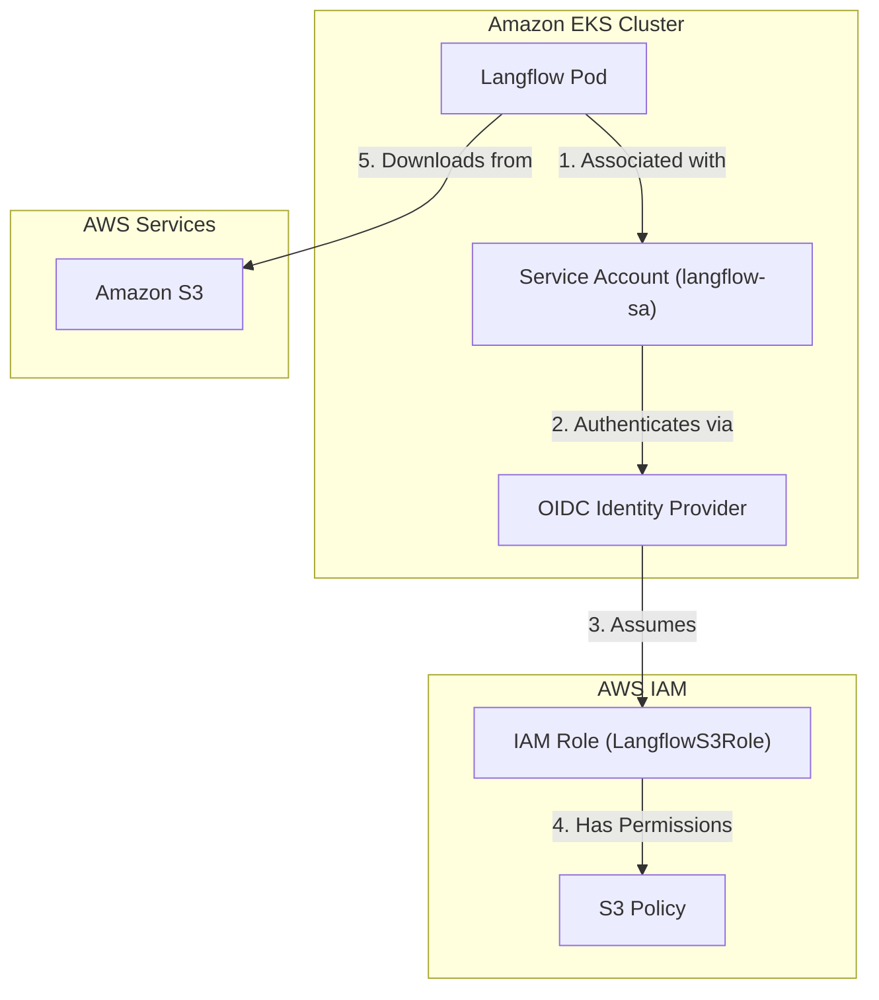

# Langflow S3 Bucket Downloader Setup Guide
## Using IAM Roles for Service Accounts (IRSA) on EKS

### Overview

This guide explains how to configure the Langflow S3 Bucket Downloader custom component running on Amazon EKS to download files from S3 using IAM Roles for Service Accounts (IRSA). The component supports multiple authentication methods including IRSA, IAM role assumption, direct credentials, and AWS CLI credentials.

### Architecture Overview



---

## Prerequisites

- An existing EKS cluster
- AWS CLI installed and configured
- `eksctl` installed (or ability to create OIDC providers manually)
- `kubectl` configured to access your EKS cluster
- Permissions to create IAM roles and policies
- `boto3` installed in the Langflow environment (`pip install boto3`)

---

## Component Features

The S3 Bucket Downloader component supports:

- **Single File Download**: Download a specific file by its S3 key
- **Prefix-based Bulk Download**: Download all files matching a given prefix
- **Multiple Auth Methods**: IRSA, IAM Role Assumption (STS), direct credentials, or AWS CLI
- **Directory Structure Preservation**: Maintains S3 folder hierarchy locally
- **Auto Directory Creation**: Optionally creates local download directories

---

## Authentication Methods

The component resolves credentials in the following priority order:

1. **IAM Role ARN** — If `role_arn` is provided, uses STS to assume the role
2. **Direct Credentials** — If `aws_access_key_id` and `aws_secret_access_key` are provided
3. **Automatic Resolution** — Falls back to AWS CLI credentials, environment variables, or IRSA

---

## Step 1: Associate OIDC Provider with EKS Cluster

If your cluster doesn't already have an OIDC provider associated, create one:

```bash
# Set your cluster details
CLUSTER_NAME="your-cluster-name"
REGION="us-east-1"

# Associate OIDC provider
eksctl utils associate-iam-oidc-provider \
  --cluster $CLUSTER_NAME \
  --region $REGION \
  --approve
```

**Verify the OIDC provider:**

```bash
aws eks describe-cluster \
  --name $CLUSTER_NAME \
  --query "cluster.identity.oidc.issuer" \
  --output text
```

This will output something like:
```
https://oidc.eks.us-east-1.amazonaws.com/id/EXAMPLED539D4633E53DE1B71EXAMPLE
```

Save this URL — you'll need the ID part (after `/id/`).

---

## Step 2: Create IAM Role with IRSA Trust Policy

### 2.1 Get Your OIDC Provider ID

```bash
OIDC_PROVIDER=$(aws eks describe-cluster \
  --name $CLUSTER_NAME \
  --query "cluster.identity.oidc.issuer" \
  --output text | sed 's|https://||')

echo $OIDC_PROVIDER
```

### 2.2 Create Trust Policy

Create a file named `irsa-trust-policy.json`:

```json
{
  "Version": "2012-10-17",
  "Statement": [
    {
      "Effect": "Allow",
      "Principal": {
        "Federated": "arn:aws:iam::YOUR_ACCOUNT_ID:oidc-provider/OIDC_PROVIDER_URL"
      },
      "Action": "sts:AssumeRoleWithWebIdentity",
      "Condition": {
        "StringEquals": {
          "OIDC_PROVIDER_URL:sub": "system:serviceaccount:langflow:langflow-sa",
          "OIDC_PROVIDER_URL:aud": "sts.amazonaws.com"
        }
      }
    }
  ]
}
```

**Replace:**
- `YOUR_ACCOUNT_ID` with your AWS account ID (e.g., `130376568147`)
- `OIDC_PROVIDER_URL` with the full OIDC URL from Step 1 (without `https://`)
- `langflow` with your namespace
- `langflow-sa` with your service account name

**Example:**
```json
{
  "Version": "2012-10-17",
  "Statement": [
    {
      "Effect": "Allow",
      "Principal": {
        "Federated": "arn:aws:iam::130376568147:oidc-provider/oidc.eks.us-east-1.amazonaws.com/id/EXAMPLED539D4633E53DE1B71EXAMPLE"
      },
      "Action": "sts:AssumeRoleWithWebIdentity",
      "Condition": {
        "StringEquals": {
          "oidc.eks.us-east-1.amazonaws.com/id/EXAMPLED539D4633E53DE1B71EXAMPLE:sub": "system:serviceaccount:langflow:langflow-sa",
          "oidc.eks.us-east-1.amazonaws.com/id/EXAMPLED539D4633E53DE1B71EXAMPLE:aud": "sts.amazonaws.com"
        }
      }
    }
  ]
}
```

### 2.3 Create the IAM Role

```bash
aws iam create-role \
  --role-name LangflowS3Role \
  --assume-role-policy-document file://irsa-trust-policy.json \
  --description "Role for Langflow to access S3 buckets via IRSA"
```

---

## Step 3: Attach S3 Permissions to the Role

### Option A: Use AWS Managed Policy (Full S3 Read Access)

```bash
aws iam attach-role-policy \
  --role-name LangflowS3Role \
  --policy-arn arn:aws:iam::aws:policy/AmazonS3ReadOnlyAccess
```

### Option B: Create Custom Policy (Least Privilege — Recommended)

Create a file named `s3-download-permissions.json`:

```json
{
  "Version": "2012-10-17",
  "Statement": [
    {
      "Effect": "Allow",
      "Action": [
        "s3:GetObject",
        "s3:HeadObject",
        "s3:ListBucket"
      ],
      "Resource": [
        "arn:aws:s3:::YOUR_BUCKET_NAME",
        "arn:aws:s3:::YOUR_BUCKET_NAME/*"
      ]
    }
  ]
}
```

**Replace `YOUR_BUCKET_NAME`** with your actual S3 bucket name.

Create and attach the policy:

```bash
# Create the policy
aws iam create-policy \
  --policy-name LangflowS3DownloadAccess \
  --policy-document file://s3-download-permissions.json

# Attach to the role
aws iam attach-role-policy \
  --role-name LangflowS3Role \
  --policy-arn arn:aws:iam::YOUR_ACCOUNT_ID:policy/LangflowS3DownloadAccess
```

### Option C: Multiple Buckets

For access to multiple buckets, add additional resource entries:

```json
{
  "Version": "2012-10-17",
  "Statement": [
    {
      "Effect": "Allow",
      "Action": [
        "s3:GetObject",
        "s3:HeadObject",
        "s3:ListBucket"
      ],
      "Resource": [
        "arn:aws:s3:::bucket-one",
        "arn:aws:s3:::bucket-one/*",
        "arn:aws:s3:::bucket-two",
        "arn:aws:s3:::bucket-two/*"
      ]
    }
  ]
}
```

---

## Step 4: Create Kubernetes Service Account

Create a file named `langflow-serviceaccount.yaml`:

```yaml
apiVersion: v1
kind: ServiceAccount
metadata:
  name: langflow-sa
  namespace: langflow
  annotations:
    eks.amazonaws.com/role-arn: arn:aws:iam::YOUR_ACCOUNT_ID:role/LangflowS3Role
```

**Replace `YOUR_ACCOUNT_ID`** with your AWS account ID.

Apply it:

```bash
# Create namespace if it doesn't exist
kubectl create namespace langflow

# Create service account
kubectl apply -f langflow-serviceaccount.yaml
```

Verify:

```bash
kubectl describe serviceaccount langflow-sa -n langflow
```

You should see the role ARN in the annotations.

---

## Step 5: Update Langflow Deployment

Update your Langflow deployment to use the service account.

Create or update `langflow-deployment.yaml`:

```yaml
apiVersion: apps/v1
kind: Deployment
metadata:
  name: langflow
  namespace: langflow
spec:
  replicas: 1
  selector:
    matchLabels:
      app: langflow
  template:
    metadata:
      labels:
        app: langflow
    spec:
      serviceAccountName: langflow-sa  # ← Important!
      containers:
      - name: langflow
        image: langflow/langflow:latest
        ports:
        - containerPort: 7860
        env:
        - name: AWS_REGION
          value: "us-east-1"
        volumeMounts:
        - name: downloads
          mountPath: /app/downloads
      volumes:
      - name: downloads
        emptyDir: {}
---
apiVersion: v1
kind: Service
metadata:
  name: langflow-service
  namespace: langflow
spec:
  selector:
    app: langflow
  ports:
  - port: 80
    targetPort: 7860
  type: LoadBalancer
```

> **Note:** The `downloads` volume mount ensures downloaded files persist within the pod's lifecycle. For persistent storage across restarts, consider using a PersistentVolumeClaim (PVC) instead of `emptyDir`.

Apply the deployment:

```bash
kubectl apply -f langflow-deployment.yaml
```

---

## Step 6: Install the Custom Component

### 6.1 Component Code

The S3 Bucket Downloader component (`s3_bucket_downloader.py`) supports:

| Input | Description | Required |
|-------|-------------|----------|
| **IAM Role ARN** | ARN of the IAM role to assume via STS | No |
| **Role Session Name** | Session name for the assumed role | No (default: `langflow-s3-session`) |
| **AWS Access Key ID** | Direct AWS access key | No |
| **AWS Secret Key** | Direct AWS secret access key | No |
| **AWS Session Token** | Temporary session token | No |
| **Region Name** | AWS region of the S3 bucket | Yes (default: `us-east-1`) |
| **Bucket Name** | Name of the S3 bucket | Yes |
| **S3 Key/Prefix** | File path or prefix to download | Yes |
| **Local Download Path** | Local directory for downloads | No (default: `./downloads`) |
| **Download Mode** | Single File or All Files with Prefix | Yes (default: `Single File`) |
| **Create Local Directory** | Auto-create download directory | No (default: `true`) |

### 6.2 Using with IRSA (Simplest Setup)

When running on EKS with IRSA configured, simply:

1. Leave **IAM Role ARN**, **AWS Access Key ID**, **AWS Secret Key**, and **AWS Session Token** empty
2. Set the **Region Name**, **Bucket Name**, and **S3 Key/Prefix**
3. Choose your **Download Mode**

The component will automatically use IRSA credentials from the pod's service account — no manual credential configuration needed.

### 6.3 Using with IAM Role Assumption

If you need to assume a specific role (e.g., cross-account access):

1. Set the **IAM Role ARN** (e.g., `arn:aws:iam::123456789012:role/MyS3Role`)
2. Optionally customize the **Role Session Name**
3. Configure bucket and key as usual

### 6.4 Using with Direct Credentials

For development or non-EKS environments:

1. Provide **AWS Access Key ID** and **AWS Secret Key**
2. Optionally provide **AWS Session Token** for temporary credentials
3. Configure bucket and key as usual

---

## Step 7: Verify the Setup

### 7.1 Check Pod Has Service Account

```bash
kubectl get pod -n langflow -o yaml | grep serviceAccountName
```

Should show: `serviceAccountName: langflow-sa`

### 7.2 Verify AWS Credentials in Pod

```bash
# Get pod name
POD_NAME=$(kubectl get pods -n langflow -l app=langflow -o jsonpath='{.items[0].metadata.name}')

# Check AWS environment variables
kubectl exec -n langflow $POD_NAME -- env | grep AWS
```

You should see:
```
AWS_ROLE_ARN=arn:aws:iam::YOUR_ACCOUNT_ID:role/LangflowS3Role
AWS_WEB_IDENTITY_TOKEN_FILE=/var/run/secrets/eks.amazonaws.com/serviceaccount/token
```

### 7.3 Test S3 Access from Pod

```bash
# Test listing a bucket
kubectl exec -n langflow $POD_NAME -- aws s3 ls s3://YOUR_BUCKET_NAME/

# Test downloading a file
kubectl exec -n langflow $POD_NAME -- aws s3 cp s3://YOUR_BUCKET_NAME/test-file.txt /tmp/test-file.txt
```

### 7.4 Verify Component Output

The component returns a list of dictionaries for each downloaded file:

```json
[
  {
    "key": "data/documents/report.pdf",
    "local_path": "./downloads/report.pdf",
    "size": 1048576
  }
]
```

For prefix-based downloads:

```json
[
  {
    "key": "data/documents/report1.pdf",
    "local_path": "./downloads/report1.pdf",
    "size": 1048576
  },
  {
    "key": "data/documents/report2.pdf",
    "local_path": "./downloads/report2.pdf",
    "size": 2097152
  }
]
```
